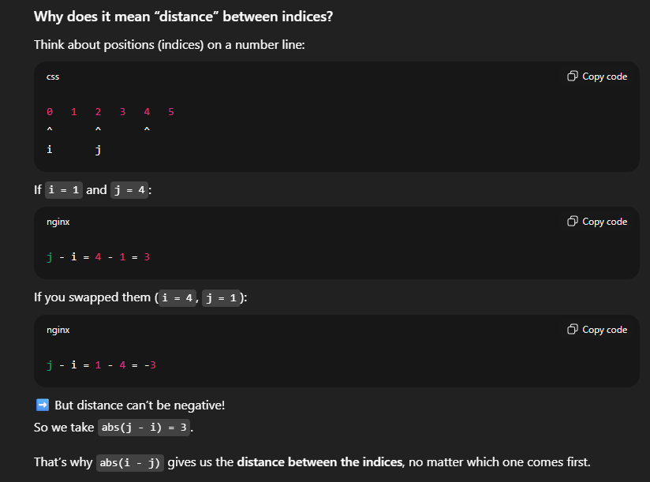

i and j are two different indices in the array where the same number appears (nums[i] == nums[j]).

abs(i - j) means the distance between those two indices.

The condition <= k means:
The duplicates must appear within k steps of each other in the array.

k is not about stopping at index k, it’s about the maximum allowed distance between duplicates.
Example with k = 4, length = 18
Check duplicates everywhere in the array.

BUT, they must be within 4 steps.

For instance:

nums[1] = 1 and nums[5] = 1
Distance = |5 - 1| = 4 → ✅ valid

If we found the same number at indices 1 and 10,
Distance = |10 - 1| = 9 → ❌ not valid (too far).

Distance can't be negative
