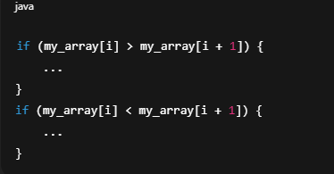

First, compare the two numbers with each other.

Then only the smaller one is checked against min and only the bigger one is checked against max.
That’s why it saves work.

If the first is bigger, then the first one is a candidate for max and the second one is a candidate for min.

If the second is bigger, then the second one is a candidate for max and the first one is a candidate for min.