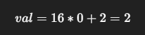
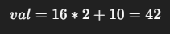
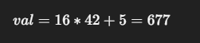
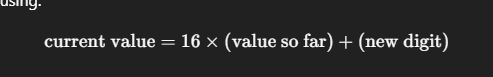

2A5:
Iterative algorithm (val = 16 * val + d)

Multiplying by 16 is like saying: “whatever I had before, move it to the next higher place value”

##In code, we process digits left to right and accumulate the decimal value as we go

Think of it like building a number in base 10:
Number = 123
Step 1: 1
Step 2: 1*10 + 2 = 12
Step 3: 12*10 + 3 = 123

##In math, each digit is multiplied by 16 to the power of its position (counting from the right, starting at 0).

