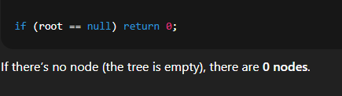
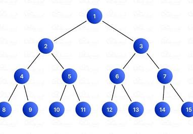

🌳 Two common definitions of tree height
1. Height in graph theory / math (non-programming world)

Height of a leaf node = 0

Height of a tree = number of edges on the longest path from root to a leaf.

So:

A single node tree → height = 0

A root + one child → height = 1

2. Height in many programming implementations

Height of a leaf node = 1

Height of a tree = number of nodes on the longest path from root to a leaf.

So:

A single node tree → height = 1

A root + one child → height = 2.

Algorithm:

         1
       / \
      2   3
     / \  /
    4  5 6

Step 1: Base case

Step 2: Find heights

Step 3: Check if the tree is perfect on one side

leftHeight = height of the left side (1→2→4) = 2

rightHeight = height of the right side (1→3→6) = 2

if (leftHeight == rightHeight)

This is checking if both sides are equally tall.

If they are equal, that means the left subtree is completely full (a perfect binary tree).
→ So we can quickly calculate how many nodes are in that whole left side without visiting each one.

If they are not equal, that means the right subtree is full, but the left one isn’t.

Step 4: How (1 << height) works

The part (1 << leftHeight) means:

1 shifted left by leftHeight bits — which is the same as 2 to the power of leftHeight.

So:

1 << 1 = 2

1 << 2 = 4

1 << 3 = 8

It’s a quick math trick to do powers of 2.

Step 4: How + countNodes(root.right) works

Means:
We start recursive counting not from the root again but from the 
root.right which is 3. So, i only count right subtree

Now count how many nodes are in the right subtree, 
because it might not be full.
The subtree is:
    3
   /
  6

Final tree:
        1
      /   \
     2     3
   /  \   /
  4    5 6

Notes:
(1 << leftHeight) counts 2^height (which is one more than the number of nodes in a perfect tree).

But since the recursion goes down and eventually counts 0 
for the null base case, 
that “extra one” ends up balancing out — 
it’s effectively counting the current root node.

Perfect binary tree:
2^height - 1
That’s the mathematical formula for how many nodes are in a perfect binary tree.

For example:

Height	Number of nodes
1	1
2	3
3	7
4	15

